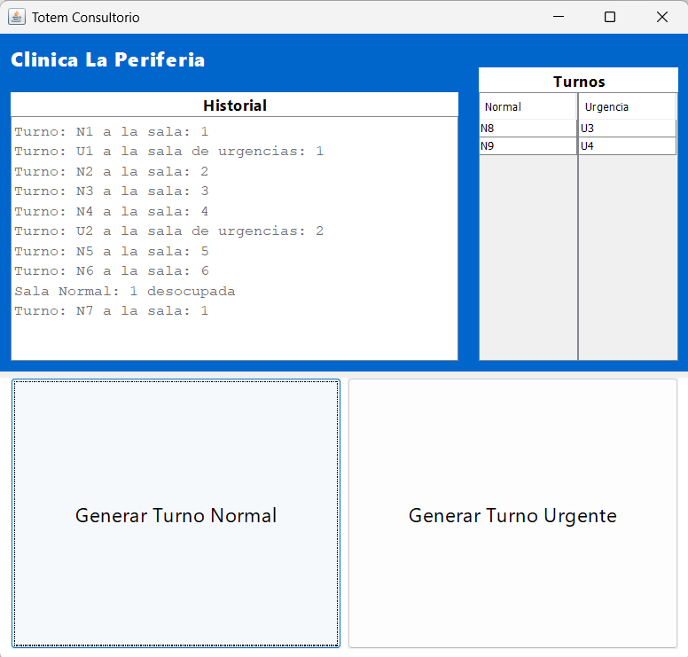

# 🩺Sistema de Turnos de Consultorio: Clinica la Periferia
(repositorio hecho con propositos estudiantiles para demostrar nuestro conocimiento para una materia "universitaria" yla clinica es una invencion para justificar el sistema, no considerar profesionalmente fuera de la inspiracion o la curiosidad.)

## ✍️Descripción del Caso
El Centro Clinico llamado: **La Periferia** recibe muchos pacientes diariamente y actualmente los turnos son gestionados de forma manual, lo que les ha causado problemas como; la doble asignacion de turnos, la falta de avisos cuando a una persona le llega su turno, dificultad para integrar nuevas interfaces (como pantallas [totems] y dispositivos móviles) y las configuraciones inconsistentes entre distintas sedes del consultorio (incluso entre dispositivos de la misma sede).

Acudieron a mi para que les pueda diseñar/crear un sistema que pueda reolver sus problemas, un sistema que:
- registre turnos rapidamente
- notifique en pantalla o sistema cuando se llame un turno
- posea la misma configuracion entre dispositivos
- sea facilmente adaptable a formas de visualizacion e interaccion

Con los requisitos que me diero hice un sistema a modo de "piloto" con el cual puedan simular el funcionamiento del sistema final y asi poder recibir su feedback para ajustarlo a lo que necesitan

---
## ✅Descripción General del Sistema

Es un sistema programado en Java con interfaz gui; programada en el IDE Apache Netbeans 25 con JDK 22, esta cuenta con botones para emitir turnos normales o turnos para urgencias (pacientes traidos en ambulancias generalmente), una tabla con la cola de turnos y un historial donde se ve que turno va a que sala medica y cuando esta se desocupa (tras terminar la visita/sesion del paciente). el diseño es sencillo pero funcional, intencionado para en un futuro dividir sus funciones en diferentes pantallas (como suele ser en otras clinicas donde hay varias pantallas mostrando la cola de turnos). por codigo este cuenta con 6 salas normales de atencion y 2 de urgencias, estas ultimas suelen desocuparse en el doble de tiempo que las salas normales:

## Clases:
Este sistema divide sus clases por **Patron de Diseño** en diferentes paquetes, para no cruzar ideas y estructuras de codigo

### 🛠️Patrón Creacional: Singleton
Este Patrón solo esta presente en la clase `ConfiguracionSistema`. Como dice su nombre, este brinda una unica fuente de configuracion centralizada la cual incluye idioma y tiempo de espera promedio de atencion entre turnos, el uso de **Singleton** nos permite evitar multiples instancias, configuraciones y comportamiento inconsistente y/o contradictorio entre pantallas, dispositivos y sedes. nos garantiza el poder evitar el problema de la duplicidad de turnos que presentaba la Clinica.

### 🌉Patron Estructural: Bridge
Este Patrón esta presente en las clases:
- `Visualizador` (abstraccion)
- `PantallaLED`
- `AppVisualizador`
- `Observador` (implementacion)

Estas clases tienen la intencion de poder mostrar los turnos en diferentes pantallas fisicas (computadoras de escritorio, moviles, totems, etc) y que los pacientes puedan ver sus Turnos y no perderlos por confusiones internas de la clinica. Separarndo la abstraccion (`Visualizador`) de la implementacion (`Observador`) nos permite añadir e implementar nuevos medios y formas distintas de visualizar a futuro sin modificar la logica principal.

### 👁️Patrón de Comportamiento: Observer
Este Patrón esta presente en las clases:

(observable)
- `GestorTurnos`

(observadores)
- `Pantalla`
- `AppMovil`

La razon para usar estas clases se debe a que cuando se emite un nuevo turno, multiples elementos deben reaccionar al evento; mostrarlo en panalla, mandar logs al sistema, actualizar informacion en apps, y no acoplar directamente la logica del turno con cada visualizador que tengamos, lo que nos permite que el sistema este desacoplado y sea escalable a la adicion de nuevos observadores (como pantallas, bots y altavoces) sin modificar la logica de `GestorTurnos`.

### 🧑‍🤝‍🧑Patrón libre elegido: Prototype
Este Patrón esta presente en las clases:
- `Turno` (clonable)
- `TurnoPrototypeManager`
- `TurnoNormal`
- `TurnoUrgente`

El uso de estas consiste en crear nuevos turnos a partir de las plantillas (normal, urgente) con propiedades predefinidas, y no tener la necesidad de recrearlas desde cero repitiendo la logica varias veces en el programa. Clonar objetos ya configurados es mas rapido que hacerlos a mano, nos ahorramos recursos y logica (volviendola mas clara), y facilita crear a futurno nuevos turnos personalizados (preferente y pediatrico por ejemplo) con un menor esfuerzo y modificacion del sistema.

### 📦Paquete Principal
Este paquete tiene las clases:
- `ClinicaPeriferia` (ejecutable de Interfaz GUI)
- `ListaConNombre` (herramienta personal)
- `CliMain` (ejeuctable de Interfaz CLI [descartado])

La Clase `ListaConNombre` estuvo destinada para ayudarme a realizar las salas de atencion en **BackEnd**. En `ClinicaPeriferia` hay un metodo para automatizar la simulacion de: "Turno X a la sala Z", donde para obtener el numero de la sala obtengo el nombre de la Lista haciendole un "substring(2)" (las listas se llaman: sn1,sn2,sn3,etc), estas listas cuentan con un valor booleano **False** o **True**, si la lista contiene **False**: toma el primer turno de la tabla de turnos, cambia su valor booleano a **True** y empieza con otro metodo con un TimerTask simulando la consulta (multiplica los minutos del "TiempoDeEspera" [valor de la clase `ConfiguracionSistema`] por 60000 [60 segundos] sumado a un tiempo de variacion aleatorio que oscila entre 0 y 7 segundos).

---
## 🤖Como Ejecutar el Programa
Antes de nada, el sistema fue programado en JDK 22, por lo que esnecesario tener instalado esta version de JDK en adelante

### Opcion 1: Descarga directa
Para descargar el archivo JAR puedes ir a este mismo repositorio en la carpeta "src", o descargarlo en el siguiente enlace:
[Descargar archivo](src/TurnosDeConsultorio.jar)
